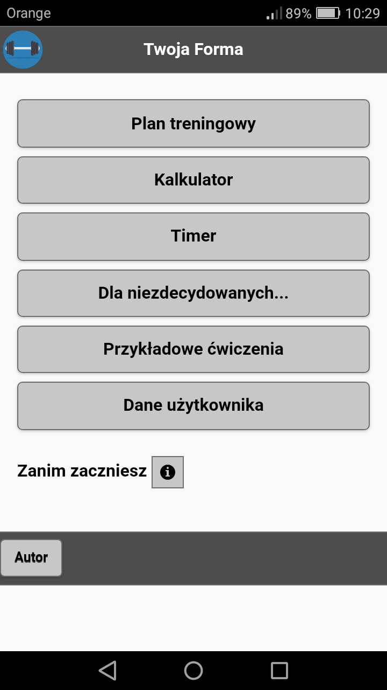
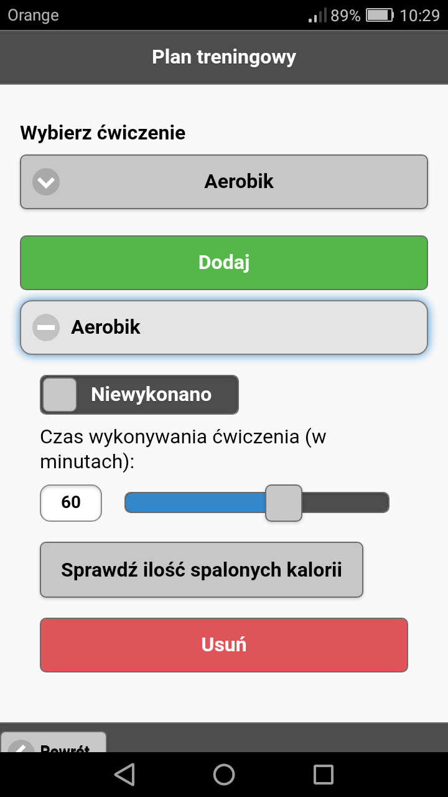
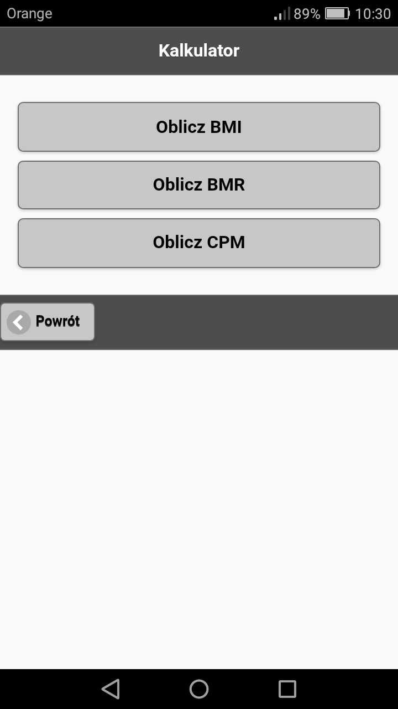
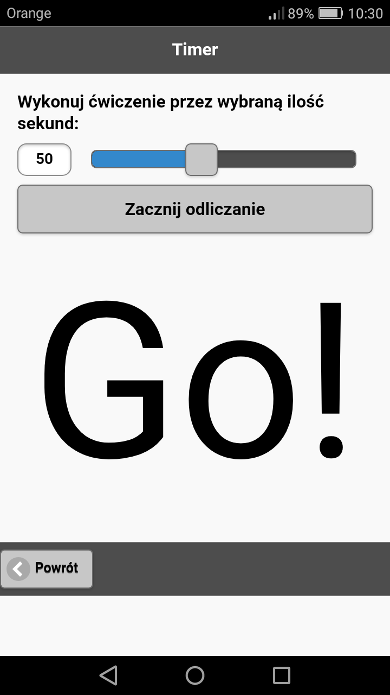
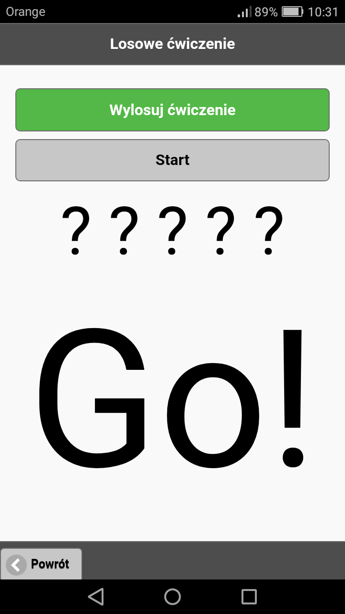
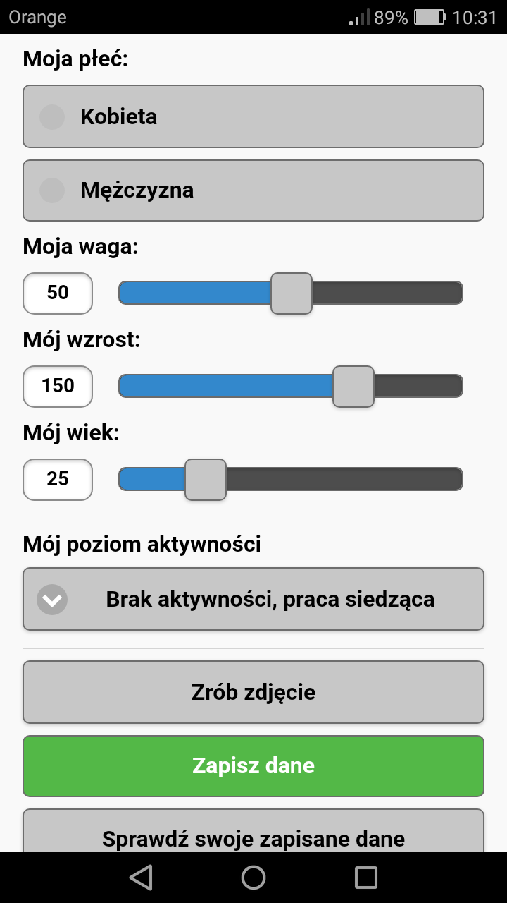

# Twoja Forma

Aplikacja ma na celu ułatwienie planowania treningów oraz ich systematyczność.
Użytkownik będzie mógł wybierać rodzaj treningu i ćwiczeń (np. bieganie, brzuszki, pompki).
Użytkownik po skończonym treningu będzie potwierdzał jego wykonanie.
W przypadku niewykonania również będzie miał możliwość zaznaczenia.

## Aplikację można pobrać [tutaj] (https://build.phonegap.com/apps/3201960/install)

# Metoda działania

Aplikacja mobilna umożliwia:
* zapisanie treningu
* zapisanie danych użytkownika
* odmierzanie czasu ćwiczenia
* oblicznie spalonych kalorii
* zapis zdjęcia do śledzenia postępów
* wyświetlanie ćwiczeń w formie gifów
* losowania ćwiczenia do wykonywania przez 1 min

# Specyfikacja

Aplikacja została napisana przy użyciu języków HTML5, JavaScript, CSS.
Do wybudowania wersji mobilnej użyta została platforma PhoneGapBuild firmy Adobe.

# Zrzuty ekranu

## Projekt realizowany na potrzeby przedmiotu Architektura środowisk mobilnych (J. Stal)